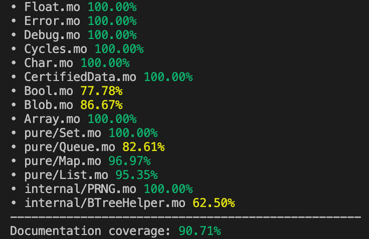
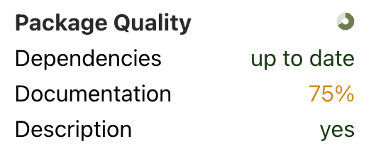
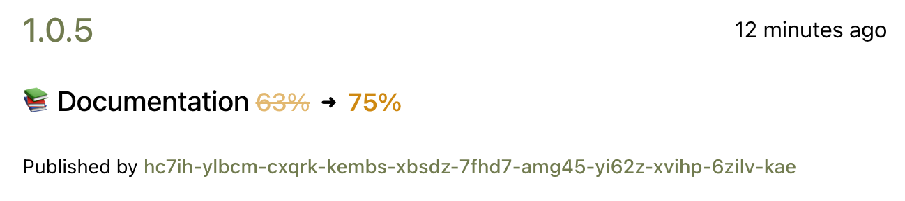
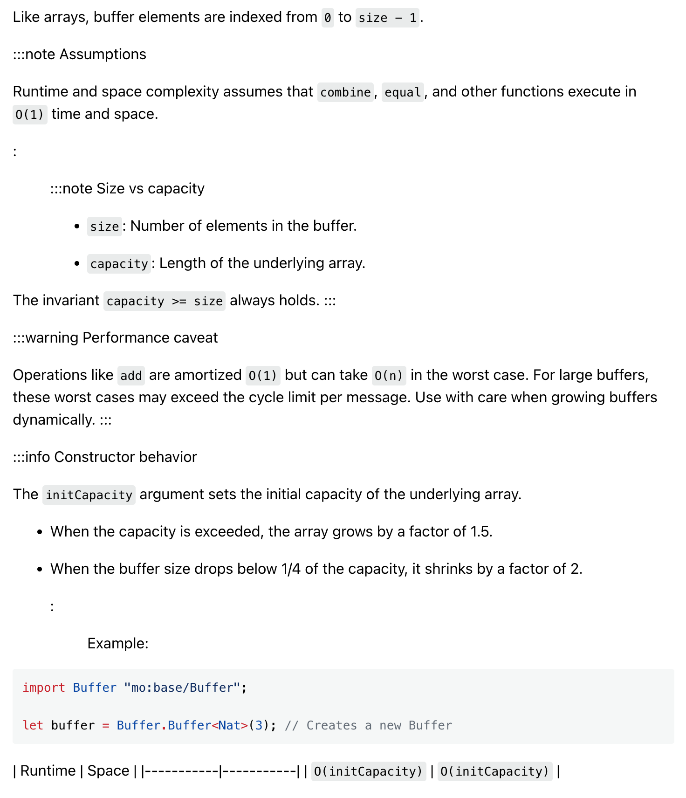
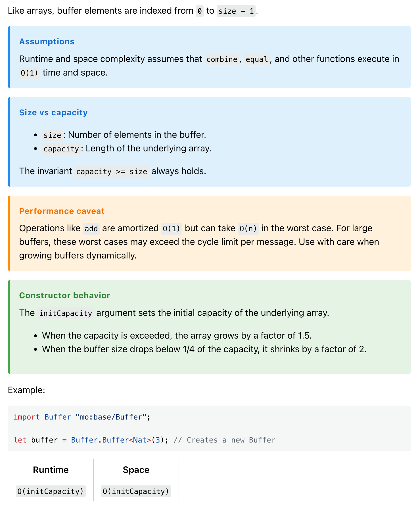

### Summary
- New `mops docs` commands for documentation generation and coverage analysis
- Package documentation coverage displayed on package pages
- Documentation coverage comparison between package versions
- GitHub dependencies prohibited in regular dependencies (dev-dependencies still allowed)
- Package documentation markdown rendering

<!-- truncate -->

## Mops CLI v1.9.0 updates

Run `mops self update` to update Mops CLI to the latest version.

### New Documentation Commands

Mops CLI v1.9.0 introduces powerful new documentation tools to help package authors improve their code documentation:

#### `mops docs generate`
Generate documentation for your Motoko packages using `mo-doc`.

[Documentation](https://docs.mops.one/cli/mops-docs-generate)

#### `mops docs coverage`
Analyze the documentation coverage of your package. This command scans through your Motoko code and provides detailed statistics about which functions, types, and vars have documentation comments.

These commands help ensure your packages are well-documented and provide a better developer experience for users of your packages.

[Documentation](https://docs.mops.one/cli/mops-docs-coverage)

## Documentation Coverage on Package Pages

Starting with packages published using CLI v1.9.0, the Mops package registry now displays documentation coverage information directly on package pages. This gives developers immediate insight into how well-documented a package is before they decide to use it.

The coverage percentage is calculated based on the ratio of documented public functions, types, and vars to the total number of public API elements in the package.

## Documentation Coverage Diff Between Versions

When viewing different versions of a package, you can now see how documentation coverage has changed between versions. This helps track improvements in package documentation over time and encourages maintainers to continuously improve their documentation.

## GitHub Dependencies Restriction

To improve dependency resolution reliability and ensure more stable package ecosystems, the Mops registry now prohibits publishing packages that have GitHub dependencies in their regular `[dependencies]` section.

Existing packages with GitHub dependencies will continue to be available in the registry, but new packages with GitHub dependencies will not be allowed to be published.

**What this means:**
- ❌ **Prohibited**: GitHub dependencies in `[dependencies]` section
- ✅ **Allowed**: GitHub dependencies in `[dev-dependencies]` section

**Why this change:**
- Ensures more reliable dependency resolution
- Prevents cascading failures from unavailable GitHub repositories
- Encourages use of stable, versioned packages from the Mops registry

## Package Documentation Markdown Rendering

Package documentation containing markdown tables and admonition boxes is now displayed correctly.

This didn't work before because Mops stores documentation in asciidoc format, but developers mostly use markdown comments for documentation.

**Before:**

**After:**

