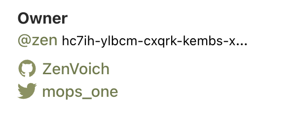

# `mops user set`

Set user properties.

```
mops user set <prop> <value>
```

You can get the current value with:
```
mops user get <prop>
```

## Available properties

- `name` - username on mops.one
- `github` - github username
- `twitter` - twitter username

## Example

```bash
mops user set name zen
mops user set github ZenVoich
mops user set twitter mops_one
```

Here is how the user info looks like on mops.one:

